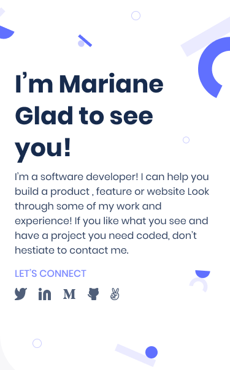
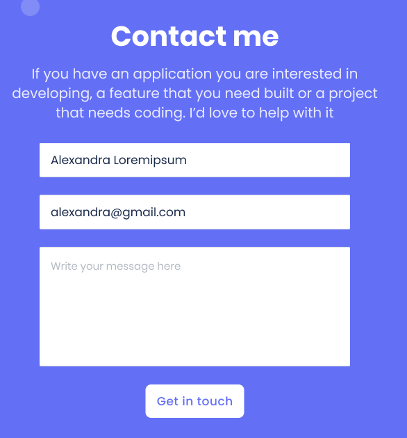

# Portfolio Project

In this project, I set up my portfolio repository. My goal here is to set up and add some customization TO  the last sections of my portfolio project. The main aim is the make the web page reponsive for disign. I make the pages to be responsive for differeng device screen and
also some animations are added in this branch

- 
- 
- 
- 
## :hammer: Built With

- HTML and CSS
- FIGMA GIT GITHUB
- VISUAL STUDIO CODE ggg
## :blue_book: Learning Objectives

- Understand how to parse a Figma design to create a UI.
- Flexbox to place elements in the page.
- Build a personal portfolio site.
- Use images and backgrounds to enhance the look of the website.
- The page designed for differnt screen device that makes this project different from the last one
- Understand how to use effect of animation and transition in a web page
- Experiancing pair programming

## Authors

👤 **JUHAR YIMER**

- GitHub: [@JUPAC](https://github.com/juaryimami)

## Acknowledgments

- Thanks to all of my coding partners